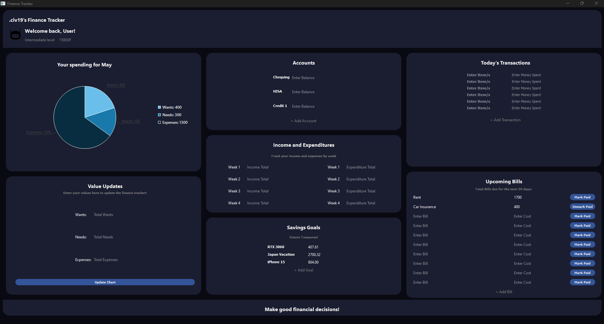
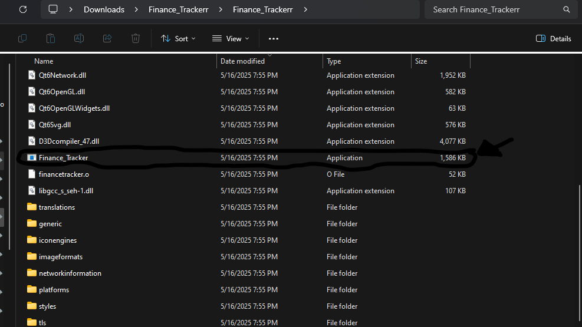

# Finance-Tracker-App

## GUI Finance Tracker App with C++ and Qt Framework

This is a polished, lightweight open source Finance Tracker that you can use for tracking your expenses. Features of this app include:
- Dynamic Pie Chart for Wants, Needs and Expenses that changes with new values
- XP for how much you use the app on runtime
- Accounts Section for checking the total balances on all of your bank accounts
- Dark, visually appealing design/UI
- Interactive Interface
- Income and expenditures
- Savings Goals
- Transactions
- Upcoming Bills to track your bill payments

## Instructions on how to run

There are a few things you need to keep in mind if you want to run this application successfully, with no headaches. Here's a step by step guide on how to make sure it runs properly:
- For the actual project, don't just download the source code. You need to navigate to the Releases section, download the zip folder for the latest version, and extract it for it to work.
- Inside the folder, you will see a folder called `Finance_Trackerr`. When you click it, you will see a bunch of build files, `.o` files, `.dll` files, etc. Don't click any of those since they just help build the app.
- What you need to click is the `executable`, or 'Application' file. You will find this while scrolling down a bit. That's the actual app, and you will be able to run it like normal.
- As for running the features themselves(such as changing the graph, adding bills etc.), it's rather self explanatory when you open the app. If you want to add a bill, transaction or savings goal, there will be an add button. If you want to update the graph, you can change the values of it in the flex box below it.
- **Easter egg:** Not much, but if you change the values of the pie chart once, your XP and level goes up! The buttons and text also change color when you hover over them.
- *Use app in fullscreen for the best experience.*

## What you *shouldn't* do

- Do not take the executable outside of the folder. It needs to be in the same file directory as the build files, or it won't run.
- Do not actually run the DLL files or the like, as stated earlier. If you just want to run the app, only worry about the actual exectuable.
  

## How to tweak this for your own uses

Since there's a lot you can do with this app, and alot you can add such as adding themes, more charts, and even things like a credit utilization page, I'd encourage you to clone and rename this project to use for your own purposes in order to truly make the best of what this application has to offer. However, you do have to setup the framework in order to change things in the code and make this app your own, so keep reading!

**Instructions on how to edit:**
- First, you'll have to [install Qt](https://www.qt.io/download-qt-installer), then the app will basically guide you on the process. If you get confused, you can watch [this tutorial](https://www.youtube.com/watch?v=OoVNt-KJ96w) on how to set it up.
- After that, all you have to do is open the `.pro` file(Qt project file), and that's it! You will be able to edit, run, and debug the code for yourself.
- When you do edit the code in qt, do **NOT** put the code in the `main.cpp` file. Put it in the `financetracker.cpp` file.

## "What if I find a bug?"
If you found any bugs, crashes, or overall any inconviences with this project, please submit an issue with the issues tap on this repository. In case you want to submit a pull request with a fix for it, reference the issue you created while you're at it!

And lastly, if you somehow liked the project or the readME and want to be generous, feel free to become a sponsor(highly optional).
  
